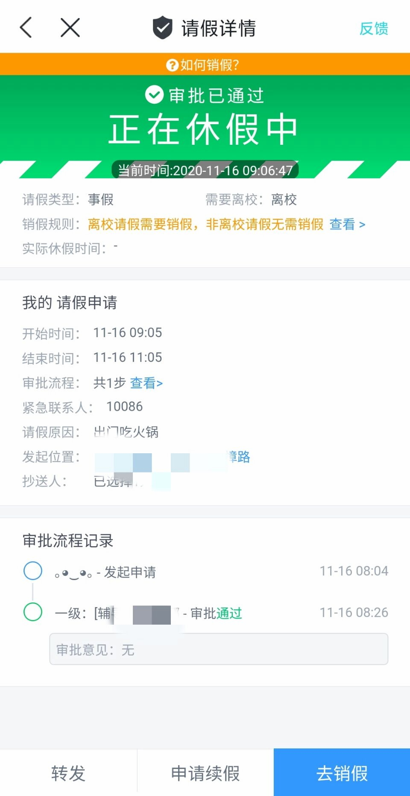

# CpdailySimulation

今日校园请假模拟安卓APP

# 使用需知

本软件完全免费可以在GitHub上免费下载到，并且仅供技术研究使用,请勿用于任何商业及非法用途,否则后果作者概不负责。
本软件完全免费可以在GitHub上免费下载到，并且仅供技术研究使用,请勿用于任何商业及非法用途,否则后果作者概不负责。
本软件完全免费可以在GitHub上免费下载到，并且仅供技术研究使用,请勿用于任何商业及非法用途,否则后果作者概不负责。
重要的事情说三遍。

# 关于全新版本

由于直接模拟今日校园的开发效率极低，目前已经该版本已停止更新。更换为更为强大的web版本(非网页方式，所以仍然只支持安卓手机)。
界面完全与今日校园一致，随意返回，所有功能控件都可点击。
		但是由于WEB版本是根据每个人的学校与学院动态生成，代码量巨大，故仅提供个性化定制服务。
因为之前免费的版本在咸鱼上被不停售卖。需要的请发邮件给我。（linkirk@163.com）
（不免费！因为是完全个性化定制，一个软件得几千行代码也得花费不少时间）

## 新版本截图示范：

请假详情页面：

主页示范：

# 如何下载

由于很多同学没用过GitHub，我这里说一下：
电脑点击右边的Releases
手机点击下面的Releases
进去找到最新发布的版本，下载APK文件即可。

# 关于APP实现

这个APP的开发我只学了一周左右，
由于是随手写的软件，也没有刻意去实现MVVM架构。
所以代码写的不是很好，也不是很规范。想学安卓开发的同学千万不要模仿我写的代码哦
对代码有任何建议的都可以给我留言。
实现的原理很简单，就是靠截图今日校园的请假界面，然后用PS切割素材，扣掉可变的文字，然后用代码去实现文字的替换

# 关于IOS版本

本软件仅用来安卓开发的学习与交流用途，并没有IOS相关版本。
